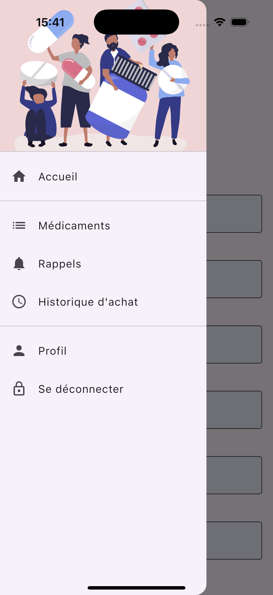
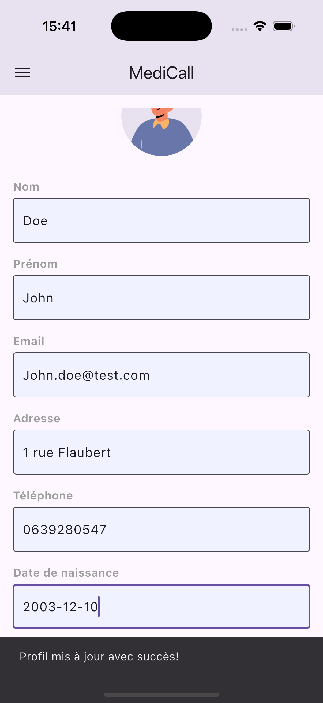
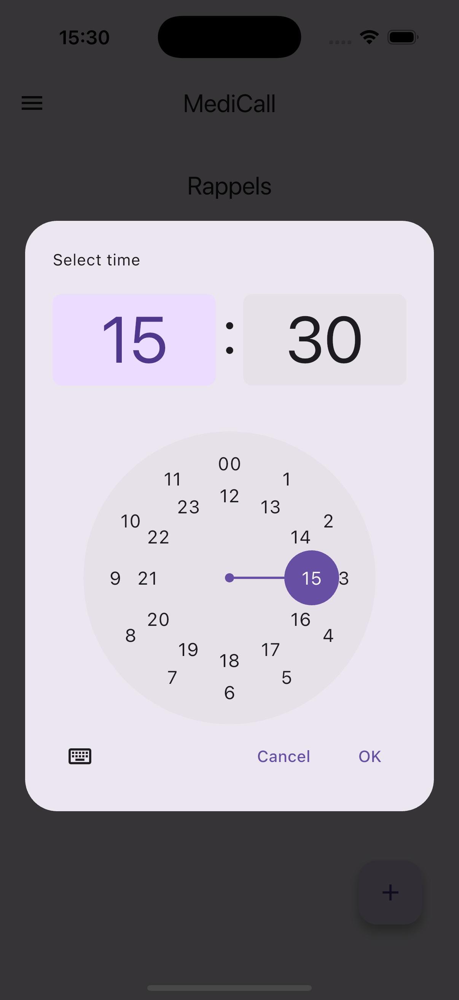

# MediCall

## Description
MediCall est une application mobile développée avec **Flutter**, disponible sur **iOS et Android**. Elle permet aux clients de **GESTINV**, une plateforme de gestion des médicaments du laboratoire **GSB**, d'accéder à une interface mobile avec plusieurs fonctionnalités :

- **Connexion et inscription** avec les identifiants du site web GESTINV.
- **Modification du compte utilisateur**.
- **Historique des achats**.
- **Rappels de prise de médicaments**, soit à partir de l'historique, soit en saisissant manuellement un médicament.
- **Stockage des rappels en local** avec `SharedPreferences`.
- **Notifications push** via **Firebase Cloud Messaging (FCM)** (fonctionnalité non disponible sur iOS sans licence développeur Apple).

## Arborescence du Projet
```
.
├── app_layout.dart
├── assets
│   ├── boy.png
│   ├── fondBurger.jpg
│   └── woman.png
├── components
│   └── reminder_dialog.dart
├── constant
├── main.dart
├── models
│   └── reminder.dart
├── pages
│   ├── historique_page.dart
│   ├── home_page.dart
│   ├── login_page.dart
│   ├── medicament_page.dart
│   ├── profile_page.dart
│   ├── rappels_page.dart
│   └── signup_page.dart
├── route.dart
├── services
│   └── auth_service.dart
└── utils
    └── reminder_storage.dart
```

## Prérequis
- Flutter SDK installé ([Guide d'installation](https://flutter.dev/docs/get-started/install)).
- Un compte Firebase et un projet configuré.
- Un émulateur ou un appareil physique pour tester l'application.

## Installation
1. **Cloner le projet** :
   ```sh
   git clone https://github.com/Shabich/MediCall.git
   cd MediCall
   ```
2. **Installer les dépendances** :
   ```sh
   flutter pub get
   ```
3. **Ajouter les fichiers Firebase** :
   - `google-services.json` dans `android/app`.
   - `GoogleService-Info.plist` dans `ios/Runner`.

## Lancement du Projet
### iOS
1. Ouvrir le projet dans Xcode :
   ```sh
   open ios/Runner.xcworkspace
   ```
2. Sélectionner un simulateur iPhone.
3. Lancer l’application avec `Run`.

### Android
1. Démarrer un émulateur ou connecter un appareil physique.
2. Lancer l’application avec :
   ```sh
   flutter run
   ```

## Fonctionnalités
### 1. Authentification Firebase
Gestion des comptes utilisateurs avec Firebase Authentication.

### 2. Gestion des rappels (Stockage Local)
Utilisation de `SharedPreferences` pour stocker les rappels localement.

### 3. Notifications Push (FCM)
- Demande d’autorisation pour recevoir des notifications.
- Réception et affichage des notifications en arrière-plan.

## Routage et Navigation
Définition des routes dans `route.dart` :
```dart
Map<String, WidgetBuilder> appRoutes = {
  '/': (context) => const LoginPage(),
  '/home': (context) => const AppLayout(child: HomePage()),
  '/rappels': (context) => AppLayout(child: ReminderPage()), 
  '/profile': (context) => const AppLayout(child: ProfilePage()),
  '/signup': (context) => const SignUpPage(),
  '/medicaments': (context) => const AppLayout(child: MedicamentListPage()),
  '/historique': (context) =>
      const AppLayout(child: HistoriqueListPage()),
};
```

## Firebase Console
La console Firebase permet de :
- Gérer l’authentification des utilisateurs.
- Envoyer des notifications push pour tester la fonctionnalité.
- Suivre les événements analytiques liés aux rappels de médicaments.

## Screenshots



## Contribution
Toute contribution est la bienvenue ! Forke ce projet et soumets une **pull request**.

## Licence
Fait par Thomas de Almeida

